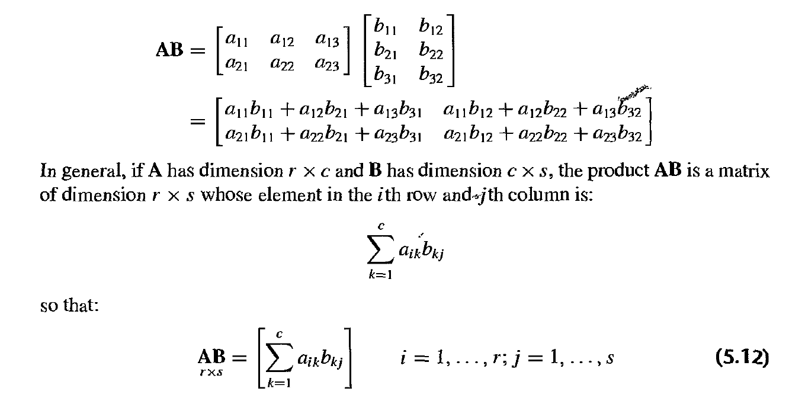
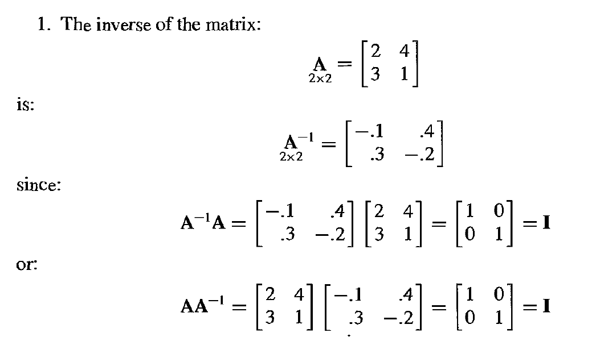
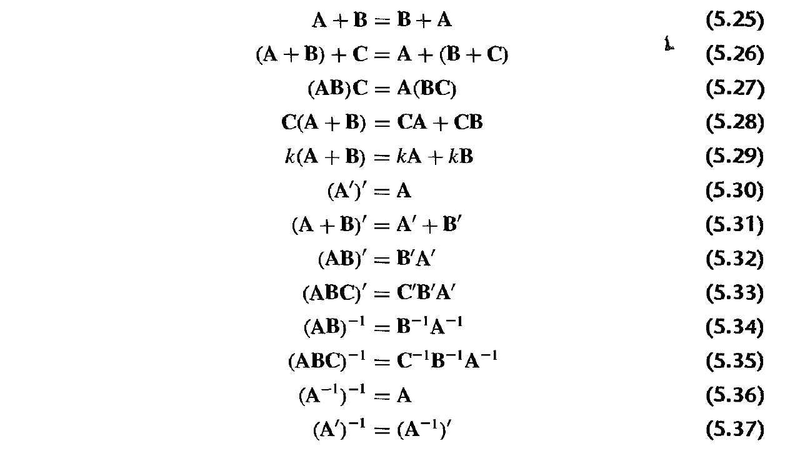
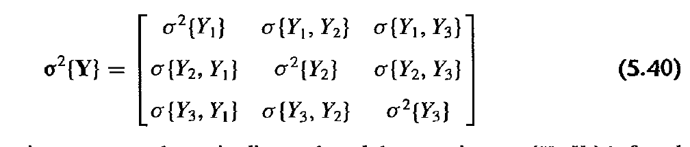
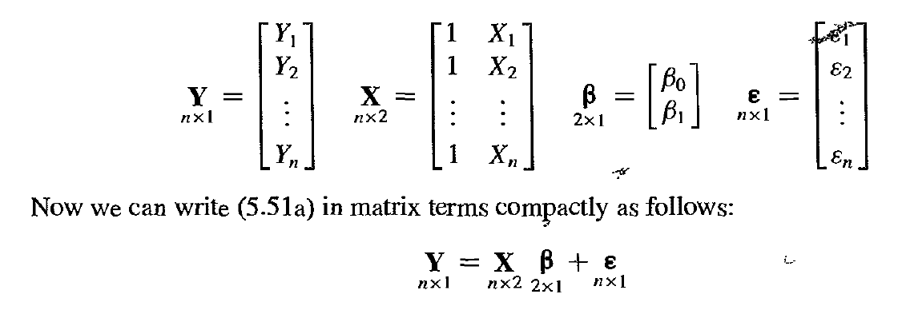

```{r setup, include=FALSE}
knitr::opts_chunk$set(echo = FALSE)
knitr::opts_chunk$set(fig.align = 'center')
library(palmerpenguins)
library(dplyr)
library(ggplot2)
library(gridExtra)
library(printr)

theme_set(theme_minimal()) # automatically set a simpler ggplot2 theme for all graphics
peng <- penguins %>% 
  filter(complete.cases(.))

```

## Review Homework

1. Make sure to submit the assigment when you are done
2. The plot was not useful because of overplotting - it's ok to have a plot that does not show any relationship
3. If you use r markdown please submit the rendered document - not the raw .Rmd
4. There seems to be a problem with .html files - I think you have to zip them prior to submitting

# Parameter Accuracy

## Where we are:

```{r}
mod <- lm(flipper_length_mm ~ body_mass_g, data = peng)
beta0 <- coef(mod)[1]
beta1 <- coef(mod)[2]
sigma <- summary(mod)$sigma
```


$$
Y = \beta_0 + \beta_1X
$$


$$
\begin{aligned}
\hat\beta_0 &= \bar{Y} - \hat\beta_1\bar{X} \\
\hat\beta_1 &= \frac{\sum{(X_i - \bar{X})(Y_i - \bar{Y})}}{\sum{(X_i - \bar{X})^2}} \\
\hat{\sigma}^2 &= \frac{\sum{(Y_i - \hat{Y_i})^2}}{n-2}
\end{aligned}
$$


## How confident are we in these values?


## Sampling Distribution of $\hat\beta_1$ {.build}

$$
E\{\beta_1\} = \hat{\beta_1} \\
\sigma^2\{\beta_1\} = \frac{\hat\sigma^2}{\sum{(X_i - \bar{X})^2}}
$$

- where we use the unbiased estimate of $\sigma^2$ from before.

```{r, echo = TRUE}
sigma_beta_1 <- sqrt(sigma^2/sum((peng$body_mass_g - mean(peng$body_mass_g))^2))
```

- The normality of the sampling distribution of $\hat\beta_1$ follows from the fact that $\hat\beta_1$ is a linear combination of $Y_i$

- What happens when we get more data?

## Standardized sample distirbution for $\hat\beta_1$

- The standardized distribution follows a t distribution with n-2 degrees of freedom

$$
\frac{\hat\beta_1 - E\{\hat\beta_1\}}{\hat\sigma^2\{\hat\beta_1\}} \sim t(n-2) 
$$
- $t$ distribution is necessary because we are estimating the variance in denominator

## Creating confidence intervals for $\hat\beta_1$

set $\alpha = .95$

$$
\hat\beta_1 + \hat\sigma * t(\frac{1-\alpha}{2}, n - 2) \\
\hat\beta_1 + \hat\sigma * t(\frac{1+\alpha}{2}, n - 2)
$$
```{r, out.width= "50%"}
p1 <- tibble(prob = seq(0,1, length.out = 1000),
       quantile = qt(prob, df = 30)) %>% 
  ggplot(aes(x = prob, y = quantile)) +
  geom_line()

p2 <- tibble(quantile = seq(-3, 3, length.out = 100),
       density = dt(quantile, df = 30)) %>% 
  ggplot(aes(x = quantile, y = density)) +
  geom_line()

grid.arrange(p2, p1, ncol =2)
```

## Example with $\beta_1$

```{r, echo = TRUE}
low_95_ci <- beta1 + sigma_beta_1*qt(.025, df = nrow(peng) - 2)
high_95_ci <- beta1 + sigma_beta_1*qt(.975, df = nrow(peng) - 2)
```

```{r}
sim_beta_1_data <- data.frame(x = seq(-3, 3, length.out = 100))
sim_beta_1_data <- sim_beta_1_data %>% 
  mutate(y = beta1 + sigma_beta_1*dt(x, df = nrow(peng) - 2))

ggplot(sim_beta_1_data, aes(x = (x*sigma_beta_1 + beta1),
                            y = y)) +
  geom_line() +
  labs(x = "beta_1",y = "density") +
  scale_x_continuous(breaks = unname(c(low_95_ci, high_95_ci, beta1)))

```

## Interpertaion of confidence interval

- It is not:
    - The true value of $\beta_1$  has a 95% chance of falling between the low and high value

- More accurate:
    - If you repeat the experiment, you expect that 95% of the CIs contain the true value of $beta_1$
 
## Sampling Distribution of $\hat\beta_0$ {.build}

$$
E\{\beta_0\} = \hat{\beta_0} \\
\sigma^2\{\beta_0\} = \hat\sigma^2  \left[\frac{1}{n} +  \frac{\bar{X}^2}{\sum{(X_i - \bar{X})^2}} \right]
$$

```{r, echo = TRUE}
sigma_beta_0 <- sqrt(sigma^2*(1/nrow(peng) + mean(peng$body_mass_g)^2/
                                sum((peng$body_mass_g - mean(peng$body_mass_g))^2)))
```

## Sampling Distribution Around $\hat{Y}$ {.build}

$$
E\{\hat{Y}_h\} = \hat{\beta_0} + \hat\beta_1X_h \\
\sigma^2\{\hat{Y}_h\} = \hat\sigma^2  \left[\frac{1}{n} +  \frac{(X_h - \bar{X})^2}{\sum{(X_i - \bar{X})^2}} \right]
$$

- What happens when X_h = 0?
- What happens when we are far from $\bar{X}$?


## Distribution for $\hat{Y}$

```{r}

peng_out <- peng %>% select(body_mass_g, flipper_length_mm)
peng_out <- bind_cols(
  peng_out,
  as.data.frame(predict.lm(mod, interval = "confidence"))
) %>% rename(conf_low = lwr, conf_high = upr)

ggplot(peng_out, aes(x = body_mass_g, y = flipper_length_mm)) +
  geom_point(aes(color = "observed data")) +
  geom_line(aes(y = fit, color = "confidence"), ) + 
  geom_ribbon(aes(ymin= conf_low, ymax = conf_high, fill = "confidence"), alpha = 0.3) + 
  scale_color_manual(values = c("observed data" =  "#9ebcda",
                                "confidence" = "#fb9a99")) +
  labs(color = "")

```

## Sampling Distribution around new observation (prediction)

$$
E\{\hat{Y}_{new}\} = \hat{\beta_0} + \hat\beta_1X_h \\
\sigma^2\{\hat{Y}_{new}\} = \hat\sigma^2  \left[1 + \frac{1}{n} +  \frac{(X_h - \bar{X})^2}{\sum{(X_i - \bar{X})^2}} \right]
$$

## Sampling Distribution around new observation (prediction)

- if you have $m$ new observations at a given $X_h$

$$
\sigma^2\{\hat{Y}_{new_m}\} = \hat\sigma^2  \left[\frac{1}{m} + \frac{1}{n} +  \frac{(X_h - \bar{X})^2}{\sum{(X_i - \bar{X})^2}} \right]
$$

```{r, warning=FALSE, out.width="60%"}

peng_out <- bind_cols(
  peng_out,
  as.data.frame(predict.lm(mod, interval = "prediction")) %>% select(-fit)
) %>% rename(pred_low = lwr, pred_high = upr)

ggplot(peng_out, aes(x = body_mass_g, y = flipper_length_mm)) +
  geom_point(aes(color = "observed data")) +
  geom_ribbon(aes(ymin= pred_low, ymax = pred_high, fill = "prediction"), alpha = 0.3) +
  geom_ribbon(aes(ymin= conf_low, ymax = conf_high, fill = "confidence"), alpha = 0.3) + 
  geom_line(aes(y = fit, color = "confidence"), ) + 
  scale_color_manual(values = c("observed data" =  "#9ebcda",
                                "confidence" = "#fb9a99")) +
  labs(color = "")

```

# Hypothesis Test

## Setup 

- We often wish to determine the significance of a variable or multiple variables. We must create a null hypothesis and an alternative hypothesis to test

$$
H_0: \beta_1 = 0 \\
H_a: \beta_1 \neq 0
$$
We set an alpha level which is the probability of rejecting the null hypothesis given that it's true. Columns show what is true:

|Study Says| $H_0$| $H_a$|
|----------|------|------|
|No effect  |Correct| Type II ($\beta$)| 
|Effect  |Type I ($\alpha$)| Correct|

## How to set $\alpha$?

- Often times alpha is set at .05 
- However it should depend on the application used
- How bad is it if you say there is an effect when there isn't one?

## What about $\beta$?

- This is related to your ability to detect an effect
- What are the two things that influence this (given a model)?


## P value

- The probability that you observe data at least as extreme as yours given the null hypothesis
- This is not the probability that your null hypothesis is true because you are assuming it already is

A low p value can happen:

- The null is true but your sample is unusual
- the null is false

## Calculating the p-value for the hypothesis above

$$
\frac{\hat\beta_1 - E\{\hat\beta_1\}}{\hat\sigma^2\{\hat\beta_1\}} \sim t(n-2) 
$$

if $H_0$ is true then $E\{\hat\beta_1\} = 0$ therefore:

$$
\frac{\hat\beta_1}{\hat\sigma^2\{\hat\beta_1\}} \sim t(n-2) 
$$
```{r, echo = TRUE}
pt(abs(beta1/sigma_beta_1^2), df = nrow(peng) - 2, lower.tail = FALSE)*2
```


## Create a fake variable for illustration

```{r}
set.seed(30)
peng$fake_random <- rnorm(nrow(peng))
fake_est <- coef(lm(flipper_length_mm ~ fake_random, data = peng))[2]
fake_est_se <- summary(lm(flipper_length_mm ~ fake_random, data = peng))$coefficients[2, 2]
```


```{r, echo = TRUE}
fake_est
fake_est_se

fake_est/fake_est_se

```

```{r, echo = TRUE}
pt(fake_est/fake_est_se, df = nrow(peng) - 2, lower.tail = TRUE) * 2
```

- This gives the same values as the F test for a single variable (see reading)

## Why double?

- We aren't assuming a direction sowe have to check both sides of the t-distribution

```{r}
tibble(quantile = seq(-3, 3, length.out = 100),
        density = dt(quantile, df = 30)) %>% 
   ggplot(aes(x = quantile, y = density)) +
   geom_line() +
   geom_vline(xintercept = fake_est/fake_est_se, linetype = "dashed") +
   geom_vline(xintercept = -fake_est/fake_est_se, linetype = "dashed", color = "red")
```

# Diagnostics

## R Squared

- The $R^2$, also called the coefficient of determination or percentage of variance explained:

$$
R^2 = 1 - \frac{\sum(\hat{y}_i - y_i)^2}{\sum(\bar{y}_i - y_i)^2} = 1 - \frac{RSS}{TSS}
$$
- What kind of model definition means that $\bar{y} =\hat{y}$?

## $R^2$ - what is it good for?

- Correlation between $\hat{y}$ and $X$
- Anscombe's Quartet - R^2 is the same for all

```{r}
bind_rows(
  anscombe %>% 
    transmute(set = 1, x = x1, y = y1),
  anscombe %>% 
    transmute(set = 2, x = x2, y = y2),
  anscombe %>% 
    transmute(set = 3, x = x3, y = y3),
  anscombe %>% 
    transmute(set = 4, x = x4, y = y4)) %>% 
  ggplot(aes(x = x, y = y)) +
  facet_wrap(~set) +
  geom_point() +
  geom_smooth(method = "lm", se = FALSE, formula = y ~x)
```

## $R^2$ words of caution

- Always improves with more predictors (number of predictors: $p$)

$$
R_a^2 = 1 - \frac{RSS/(n-p)}{TSS/(n-1)}
$$

- Is not easily generalized to other types of models - the deviance is more general. 
- For the linear model the deviance is the RSS

## Residuals

- In my opinion the best way to diagnose model issues
- Make sure nothing totally wrong is happening

```{r}
peng$fitted <- fitted.values(mod)
peng$residuals <- residuals(mod)
```

## Residuals | predictor variable (1)

```{r}
peng %>% 
  ggplot(aes(x = body_mass_g, y = residuals)) +
  geom_point() +
  geom_hline(yintercept = 0, linetype = "longdash", color = "grey70")

```

## Residuals | predictor variable (2)

```{r, echo = TRUE}
bill_length_mod <- lm(bill_length_mm ~ body_mass_g, data = peng)
bill_length_residuals <- residuals(bill_length_mod)
```

```{r}
peng %>% 
  mutate(bill_length_residuals = bill_length_residuals) %>% 
  ggplot(aes(x = body_mass_g, y = bill_length_residuals)) +
  geom_point() +
  geom_hline(yintercept = 0, linetype = "longdash", color = "grey70") +
  labs(title = "Issues with Homoscedasticity")

```
## Residuals| Fitted Values

```{r}
peng %>% 
  ggplot(aes(x = fitted, y = residuals)) +
  geom_point() +
  geom_hline(yintercept = 0, linetype = "longdash", color = "grey70") +
  labs(caption = "Especially useful when you have multiple predictors")
```

## Residuals | Normal Q-Q Plot

- Standardized residuals

$$
var(\hat\epsilon) = \hat\sigma^2(1-h_{ii})
$$
where $h_ii$ is the leverage of a point which is defined as:

$$
Hy = X(X'X)^{-1}X'y = \hat y
$$

```{r, out.width="40%"}
peng %>% 
  mutate(qq_resid = qnorm(ecdf(residuals)(residuals))) %>% 
  ggplot(aes(x = qq_resid, y = rstandard(mod))) +
  geom_point() +
  geom_abline(intercept = 0, slope = 1, color = "red", linetype = "longdash")
```

## Residuals | Against other predictor

```{r}

p1 <- peng %>% 
  ggplot(aes(x = species, y = residuals)) +
  geom_boxplot() +
  geom_hline(yintercept = 0, linetype = "longdash", color = "grey70")

p2 <- peng %>% 
  ggplot(aes(x = bill_depth_mm, y = residuals)) +
  geom_point() +
  geom_hline(yintercept = 0, linetype = "longdash", color = "grey70")

grid.arrange(p1, p2, ncol = 2)
```

# Extending the ordinary model

## Let's add predictors

$$
Y = \beta_0 + \beta_1X_1 + \beta_2X_2 + \cdots + \beta_{p-1}X_{p-1} +\beta_pX_p 
$$

## Add species as another variable | original model


```{r, echo =TRUE}
model1 <- lm(flipper_length_mm ~ body_mass_g, data = peng)
summary(model1)
```

## Add species as another variable | adding species

```{r, echo = TRUE}
model2 <- lm(flipper_length_mm ~ body_mass_g + species, data = peng)
summary(model2)
```

## Qualitative Variables

- Create dummy variables

```{r}
bind_cols(
  peng[,'species'],
  as.data.frame(model.matrix(~species, data = peng)) %>%select(-`(Intercept)`)
) %>% 
  distinct()
```

## Add species as another variable | adding species

```{r}
summary(model2)
```

## Variable Selection

Look at AIC when fitting data using MLE

$$
AIC = -2l + 2p
$$
where $l$ is the maximum log likelihood and p is the number of parameters

a smaller number is better

```{r, echo = TRUE}
AIC(model1)
AIC(model2)
```


# Matrix Approach

## Matrix Approach

```{r, out.width="100%"}

```


## Inverse of matrix

```{r, out.width="100%"}

```

## Other Matrix Properties

```{r, out.width="100%"}

```


## Variance-Covariance Matrix

```{r, out.width="100%"}

```

## Simple Model in Matrix Form

```{r, out.width="100%"}

```


