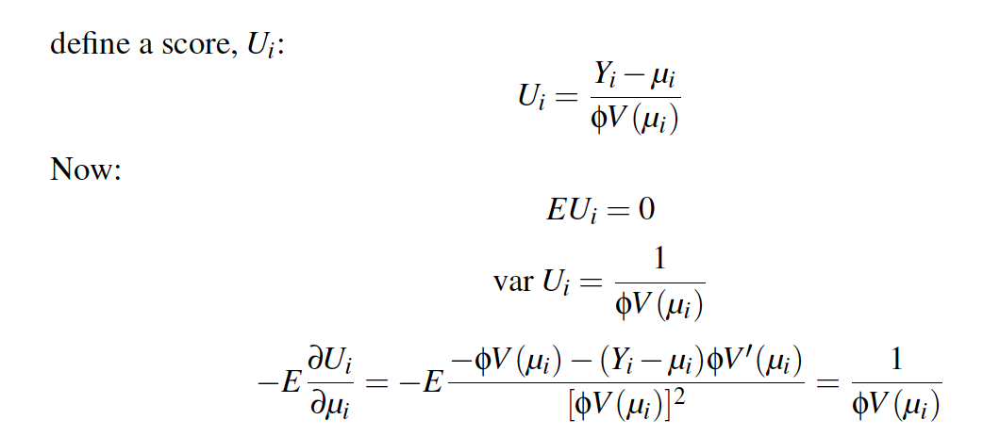

```{r setup, include=FALSE}
knitr::opts_chunk$set(echo = FALSE)
knitr::opts_chunk$set(fig.align = 'center')
library(faraway)
library(dplyr)
library(ggplot2)
library(gridExtra)
library(printr)

theme_set(theme_minimal()) # automatically set a simpler ggplot2 theme for all graphics

```


# Binomial Regression Model

## Generalized Bernoulli

- $Y_i$ for $i = 1,..., n$ is binomially distributed $B(m_i, p_i)$

$$
P(Y_i = y_i) = {m_i \choose y_i}p_i^{y_i}(1-p_i)^{m_i - y_i}
$$

- For example there a $m$ coin flips with the same coin (e.g. a quarter) and $y$ heads. The quarter has probability $p$ for landing heads up.

## Log-likelihood

- Use logistic link function $\eta_i = log(p_i/(1-p_i))$
- Use the same 
$$
l(\beta) = \sum^n_{i = 1}{y_i\eta_i - m_ilog(1 + e_i^\eta) + log{m_i \choose y_i}}
$$

## Challenger Example

- O ring damage at different temperatures

```{r}
lmod <- glm(cbind(damage,6-damage) ~ temp, family=binomial,orings)
fake_data <- data.frame(temp = 25:85)
fake_data$pred <- predict(lmod, fake_data, type = "response")
ggplot(orings, aes(x = temp, y = damage/6)) +
  geom_point() + 
  geom_line(data = fake_data, aes(y = pred), linetype = "longdash") +
  scale_x_continuous(breaks = c(31, 40, 50, 60, 70, 80))

```

## Fit a binomial model

```{r, echo = TRUE}
lmod <- glm(cbind(damage,6-damage) ~ temp, family=binomial,orings)
broom::tidy(lmod, conf.int = TRUE)

faraway::ilogit(11.6630-0.2162*31)
```

## Deviance

$$
D = 2 \sum_{i=1}^n \left( \frac{y_ilog(y_i)}{\hat y_i} + \frac{(m_i - y_i)log(m_i-y_i)}{m_i - \hat y} \right)
$$

- Deviance is $\chi^2_{n-q-1}$ to check fit

```{r, echo = TRUE}

pchisq(deviance(lmod),df.residual(lmod),lower=FALSE)

# NULL Model
pchisq(38.9,22,lower=FALSE)

broom::glance(lmod)
```

- This is an approximation (m > 5)

## Compare Models

1. Chi-squared:

```{r, echo = TRUE}
pchisq(38.9-16.9,1,lower=FALSE)
```

2. Z-value

```{r}
broom::tidy(lmod)
```

## Comparison to Bernoullli

-  You 'ungroup' the data and run as bernoulli
- You will get the same exact estimates (just no way to run goodness of fit test)

## Pearson $\chi^2$

$$
X^2 = \sum\frac{(O - E)^2}{E}
$$

- For binomial case

$$
O_s = y, \space  O_f = n - y \\
E_s = n_i\hat p, \space  E_f = n(1-\hat p) \\
X^2 = \sum\frac{(y - n\hat p)^2}{n\hat p (1-\hat p )}

$$

- denominator is the variance of binomial variable

## Pearson Residual

$$
r^p_i = \frac{y_i - n_i\hat p_i}{\sqrt{var(\hat y)}} \\
X^2 = \sum (r^P_i)^2
$$
- It's useful to use this as a standardized residual

# Overdispersion


## Reasons for poor fit {.larger}

- If the binomial model specification is correct, we expect that the residual deviance
will be approximately distributed $\chi^2$ with the appropriate degrees of freedom. Sometimes,
we observe a deviance that is much larger than would be expected if the model
were correct.

- Incorrect model
    - This is hard to show but sometimes you are limited by the data you have
- Outliers
    - Look at the residuals to see if they are driving deviance
- Sparse data
    - Small groups (when n = 1 it's binary and this is not valid)
- Poor fit may result from an incorrect specification of the error term
    - $var(y) > mp(1-p)$ is overdispersion (if less than than under dispersion)
    

## Overdispersion Example

- Boxes of trout eggs were buried at 5 different locations and retrieved. Number of surviving eggs was recorded.


```{r}
data(troutegg, package="faraway")
ftable(xtabs(cbind(survive,total) ~ location+period, troutegg))
```

## Fit Model...

```{r, echo = TRUE}
bmod <-glm(cbind(survive,total-survive) ~ location + period, family = "binomial", troutegg)
```
```{r}
broom::glance(bmod)
broom::tidy(bmod)
```

## Model Diagnostics

- Model does not fit well because deviance is high

```{r, echo = TRUE}
pchisq(64.495, 12, lower.tail = FALSE)
```

## Data Checks

- halfnormal plot (like qq plot but with smaller n) for outliers
- graph below adapted from `faraway::halfnormal`

```{r}
resid <- residuals(bmod)
x <- abs(resid)
labord <- order(x)
x <- sort(x)
i <- order(x)
n <- length(x)
ui <- qnorm((n + 1:n)/(2 * n + 1))
data.frame(
  ui = ui,
  abs_resid = x[i]
) %>% 
  ggplot(aes(x = ui, y = abs_resid)) +
  geom_point() +
  geom_abline(intercept = 0, slope = 1, linetype = "longdash") +
  coord_equal()

```


## Interaction Plots

```{r, echo = TRUE}
# no obvious changes in slopes of lines
troutegg %>% 
  mutate(elogit = log((survive + .5)/(total-survive+.5))) %>% 
  ggplot(aes(x = period, y = elogit, linetype = location )) +
  geom_line(aes(group = location))
```

## Expected vs Actual

```{r, echo = TRUE}
troutegg %>% 
  mutate(pred = predict(bmod, ., type = "response")) %>% 
  ggplot(aes(x = survive/total, y = pred)) +
  geom_point() + geom_abline(slope = 1, intercept = 0, linetype = "longdash") +
  facet_wrap(~location) + coord_equal()
```

<!-- ## Obs vs Exp Variation -->

# ```{r}
# troutegg %>%
#   mutate(obs_var = ((survive/total)*(1-survive/total))) %>%
#   mutate(exp_var = predict.glm(bmod, . ,se.fit = T, type = "response")$se) %>%
#   ggplot(aes(x = obs_var, y = exp_var)) +
#   geom_point() +
#   geom_abline(slope = 1, intercept = 0)
# 
# var(troutegg$survive)
# 
# sum(troutegg$total)* sum(troutegg$survive)/sum(troutegg$total) * (1 - sum(troutegg$survive)/sum(troutegg$total))
# ```


## Overdispersion Reasons

- Missing predictor variable
    - If temperature is not the only predictor (still missing information)

- Clustering
    - Imagine sample size $m$ with $k$ in each cluster and $l = m/k$ clusters
    - Each cluster share the same $p_i$ so that the successes in cluster $i \sim B(k, p_i)$
    - $E p_i = p$ and $var \space p_i = \tau^2p(1-p)$
    - successes $Y = Z_1 + \cdots + Z_l$

## Overdispersion | Clustering

$$
EY = \sum EZ_i = \sum_{i = 1}^l kp_i = mp 
$$
$$
var \space Y = \sum var Z_i = (1 + (k-1)\tau^2)mp(1-p)
$$
which is greater than $mp(1-p)$

## Modeling Overdispersion | Dispersion Parameter

$$
var \space Y = \sigma^2 mp (1-p) \\
\hat\sigma^2 = \frac{X^2}{n - p}
$$

- what do we expect $\hat\sigma^2$ to be if there is no overdispersion?

## Modeling Overdispersion | Dispersion Parameter

- This scales the standard error of all parameters by $\hat\sigma$

$$
\hat{var} \hat\beta = \hat\sigma^2(X^T\hat WX)^{-1}
$$

## Compare models using F statistic 

$$
F = \frac{(D_{small} - D_{large})/(df_{small} - df_{large})}{\hat\sigma^2}
$$

## Modeling Overdispersion | Trout Example

```{r echo = TRUE}
sigma2 <- sum(residuals(bmod, type = "pearson")^2/df.residual(bmod))
sigma2
```

## Summary Statistics | No Dispersion

```{r, echo = TRUE}
summary(bmod)
```


## Summary Statistics | Dispersion

```{r, echo = TRUE}
summary(bmod, dispersion = sigma2)
```

# Quasi Binomial

## Set up {.larger}

- Specify the mean and variance of the response as functions of the linear predictor

- You do not need to make an assumption about the underlying distribution that these two values describe

- It's possible to set up quasi-likelihood functions that mimic likelihood functions

- This allows you to calculate the quasi-deviance/standard error etc.


## Quasi Binomial - formulas

- Assume that: $mean(Y_i) = \mu_i$ and $Var(Y_i) = \phi V(\mu_i)$
- Note that the mean and Var are just functions of $\mu$ ($\phi$ is a scalar)

```{r, out.width="75%"}

```

## Score function vs log-likelihood

- These properties are shared with the derivative of the log-liklihood (see page 376 of text)
- Therefore $U$ can be used in place of $l'$ (the derivative of thelog-likelihood)

Quasli log-likelihood:

$$
Q_i = \int_{y_i}^{\mu_i} \frac{y_i - t}{\phi V(t)} dt
$$

$$ 
Q = \sum_{i=1}^n Q_i
$$


## Likelihood Comparison

- See the Appendix of book for more details
- What is $V(\mu)$ for the standard linear model?

- Although quasi-likelihood estimators are attractive because they require fewer assumptions, they are generally less efficient than the corresponding regular likelihoodbased estimator. So if you have information about the distribution, you are advised to use it.

## Deviance

same as before


$$
Q = -2 \sum_i \int_{y_i}^{\mu_i}\frac{y_i - t}{ V(t)} dt
$$

## Example Data


```{r, echo = TRUE}
data(mammalsleep, package="faraway")
mammalsleep$pdr <- with(mammalsleep, dream/sleep)
summary(mammalsleep$pdr)
```

```{r, echo = TRUE}
modl <- glm(pdr ~ log(body)+ log(brain) + log(lifespan) + log(gestation) + predation + exposure + danger, 
            family= quasibinomial, mammalsleep)
```

## Summary of Model

```{r, echo = TRUE}
summary(modl)
```

## Step the model and show summary

```{r, echo = TRUE}
drop1(modl, test = "F")
```

## New model after selecting variables using F test

```{r, echo = TRUE}
modl <- glm(pdr ~ log(body) + log(lifespan) + danger, family= quasibinomial, mammalsleep )
broom::tidy(modl)
```

- what does the log of the predictor variable represent?

## What happens on the linear scale?

```{r, echo = TRUE}
fake_data <- data.frame(body = seq(0.005, 6654, length.out = 10000))
copy_d <- mammalsleep

mod_lin <- glm(pdr ~ body, family= quasibinomial, mammalsleep)
mod_log <- glm(pdr ~ log(body), family= quasibinomial, mammalsleep)

fake_data$linear_body_pred <- predict(mod_lin, fake_data, type = "response")
fake_data$log_body_pred <- predict(mod_log, fake_data, type = "response")


copy_d$linear_body_pred <- predict(mod_lin, copy_d, type = "response")
copy_d$log_body_pred <- predict(mod_log, copy_d, type = "response")
```


## Look at fake data

```{r}
ggplot(fake_data, aes(x = body)) +
  geom_line(aes( y = linear_body_pred, color = "Linear")) +
  geom_line(aes( y = log_body_pred, color = "Log"))
```
## Fake data zoom in

```{r}
ggplot(fake_data, aes(x = body)) +
  geom_line(aes( y = linear_body_pred, color = "Linear")) +
  geom_line(aes( y = log_body_pred, color = "Log")) +
  coord_cartesian(c(0,1000))
```


## Look at fitted values

```{r}
ggplot(copy_d, aes(x = body)) +
  geom_line(aes( y = linear_body_pred, color = "Linear")) +
  geom_line(aes( y = log_body_pred, color = "Log")) +
  geom_point(aes(y = pdr, color = "Actual")) +
  labs(y = "")
```


## Beta Regression

- Useful for bounded regression (e.g. $[0, 1]$)

$$
f(y|a,b) = \frac{\Gamma(a + b)}{\Gamma(a)\Gamma(b)} y^{a-1} (1-y)^{b-1}
$$
- reparametrize so that $\mu = a/(a+b)$ and $\phi = a + b$ and set $\eta = logit(\mu)$

## Fit Beta regression

```{r, echo = TRUE}
suppressPackageStartupMessages(library(mgcv))
modb <- gam(pdr ~ log(body)+log(lifespan) + danger, family=betar(), mammalsleep)
summary(modb)
```


