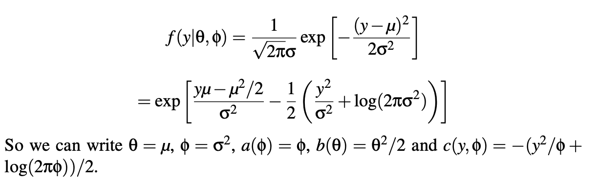
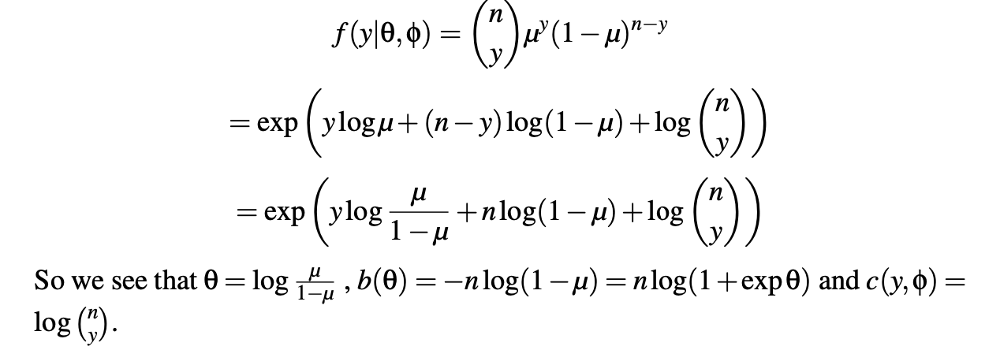
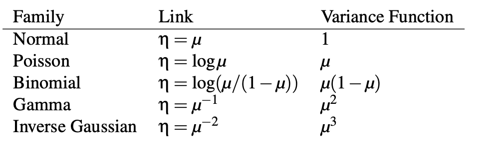

```{r setup, include=FALSE}
knitr::opts_chunk$set(echo = FALSE)
knitr::opts_chunk$set(fig.align = 'center')
library(faraway)
library(MASS)
library(dplyr)
library(ggplot2)
library(gridExtra)
library(printr)
library(tibble)
library(purrr)
library(broom)

theme_set(theme_minimal()) # automatically set a simpler ggplot2 theme for all graphics
```

# GLM Definition

## Setup

- We have now taken a deep look at normal (Gaussian), binomial/bernouilli, Poisson and Multinomial data.
- We have seen that lots of the same tools work on all of them
- This is because they are all _generlized linear models_ which we will define today.

## GLM Definition

- Two components

1. The response should be a member of the exponential family distribution and 
2. the link function describes how the _mean_ of the response is related to the predictors.

## Exponential Family

$$
f(y| \theta, \phi) = exp\left[ \frac{y\theta - b(\theta)}{a(\phi)} + c(y, \phi)     \right]
$$

- $\theta$ is the canonical parameter and is related to location
- $\phi$ is dispersion parameter and represents the scale


## Poisson

$$
\begin{aligned}
f(y|\theta, \phi) & = \frac{e^{-u}\mu^y}{y!} \\
& = exp(\textrm{log}(e^{-u}) + \log(\mu^y) - \textrm{log}\, y!\\
& = exp(- \mu + y\,\textrm{log}\,\mu - \textrm{log}\,y!)\\
& = exp(y\,\textrm{log}\,\mu - \mu - \textrm{log}\,y!)
\end{aligned}
$$


- $\theta = log(\mu)$
- $\phi = 1$
- $a(\phi) = 1$
- $b(\theta) = \textrm{exp}(\theta) = \mu$
- $c(y, \phi) = -\textrm{log} \, y!$


## Normal/Gaussian

```{r, out.width="100%"}

```

## Binomial

```{r, out.width = "100%"}

```


## Derive Properties of Exponential Distribution

-log-likelihood

$$
l(\theta) = (y\theta - b(\theta))/ a(\phi) + c(y,\phi)
$$
- taking derivative

$$
l'(\theta) = (y - b'(\theta))/a(\phi)
$$
- take expectation over Y

$$
E\,l'(\theta) = (EY - b'(\theta))/a(\phi) = 0
$$
$$
EY = \mu = b'(\theta)
$$
- see book for derivation of variance (function of both location and scale parameter):

$$
var Y = b''(\theta) a(\phi)
$$


## Link Functions

g is is the link function

$$
\eta = g(\mu)
$$

- the canonical link has g such that:

$$
\eta = g(\mu) = \theta
$$
$$
g(b'(\theta)) = \theta
$$

## Canonical Links

```{r, out.width = "100%"}

```

## See reading for

Deviance


